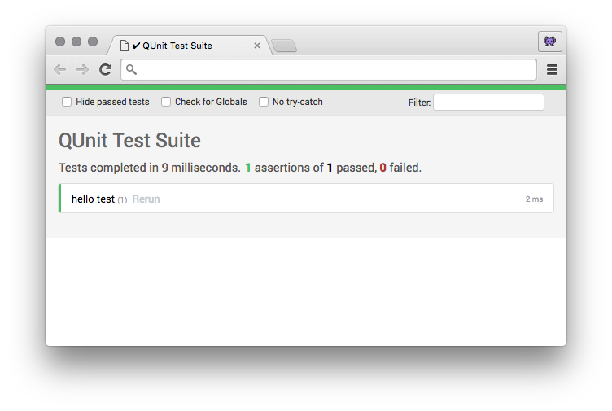

# QUnit Light Theme

## Usage

1. Install this plugin (either as git submodule, as npm dependency, or otherwise)
2. Remove `<link rel="stylesheet" href="qunitjs/qunit/qunit.css">`
3. Add `<link rel="stylesheet" href="qunit-theme-light/dist/qunit-theme-light.css">`

